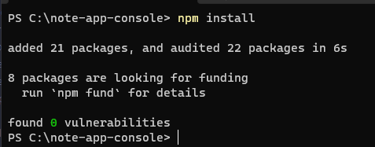
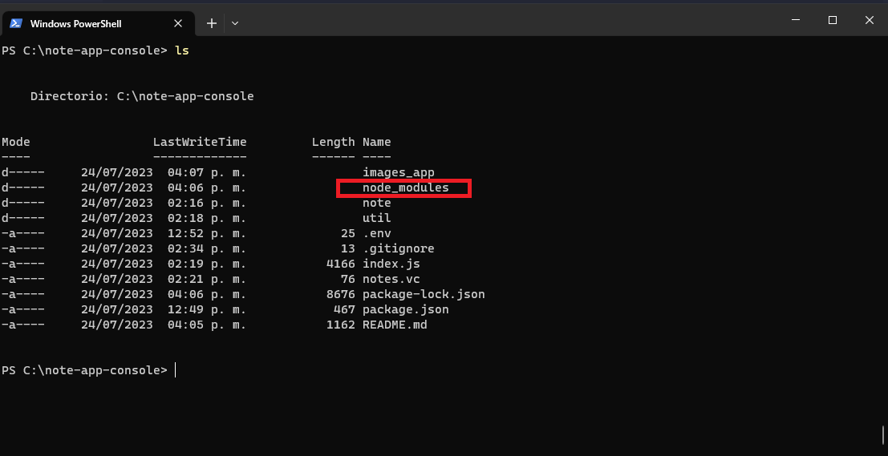
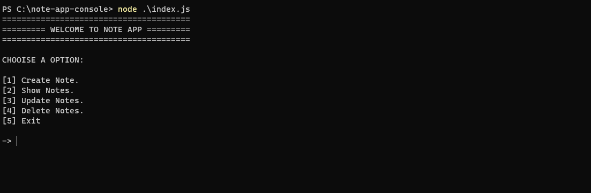
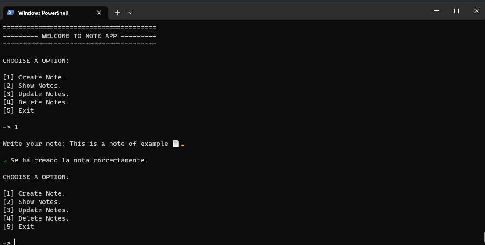
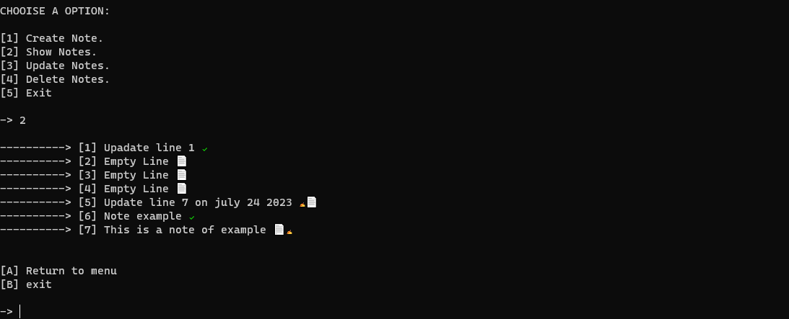
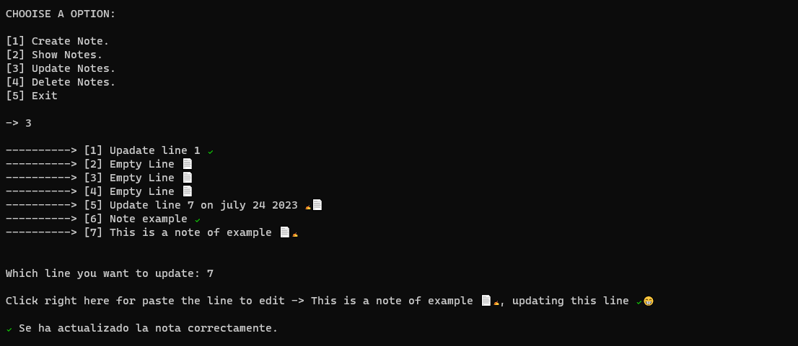
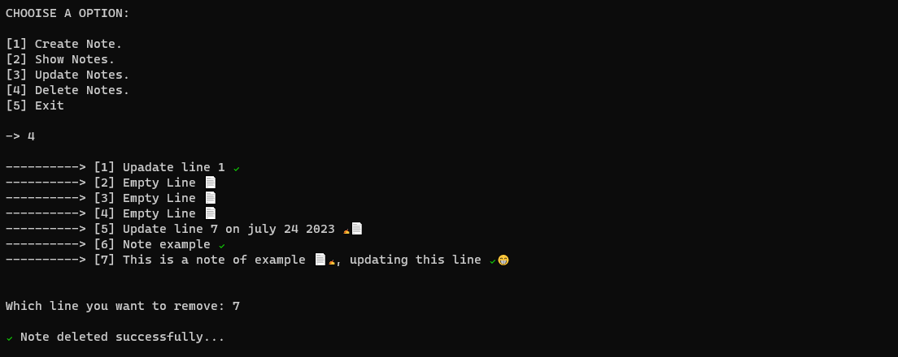

<h1 align="center">NOTE APP - NODEJS</h1>

## CONTENT

* [Requeriments](#requeriments)
* [How init the App](#how-init-the-app)
* [How use the app](#how-use-the-app)

## Requeriments
- NodeJS
- NPM

## How init the app

1. The first step is open the your terminal or console (after clone this repository).

2. Then you should use "cd" to change directory to "note-app-console" folder.

3. Finally, you need to run the following "npm install" command, this command will install all the necessary dependencies for the application.

5. You can see in the folder a new "node_modules" folder, these are all the modules needed for the application.
   

## How use the app

1. When you install all the dependencies, run the command "node ./index.js", then you see the next menu:

2. If you select the option "1" Create Note -> you can create new note:

3. If you select the option "2" Show Notes -> you can watch the notes:

4. If you select the option "3" Update Note -> you can edit your notes:

5. If you select the option "4" Delete Note -> you can delete any note:

Note 📄✍: The file 📄 "notes.vc" is necessary because in this file save all notes.

